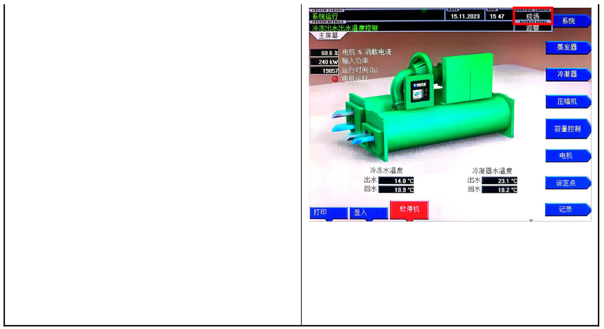

冷水机组状态查看操作流程标准(SOP)  

<html><body><table><tr><td rowspan="2">第01部分 SOP标题</td><td>流程名称</td><td>流程编号</td><td>版本号</td></tr><tr><td>冷水机组状态查看（SOP)</td><td>SD-YJD-LSJZ-01</td><td>V1.0</td></tr><tr><td rowspan="2">第02部分 现场信息</td><td>基地名称</td><td>适用范围</td><td>专业负责人</td></tr><tr><td>云计算基地</td><td>A2</td><td>叶笑鸣</td></tr><tr><td rowspan="4">第03部分 设备信息</td><td>设备厂家</td><td>设备名称</td><td>设备型号 YKK8K3H95ERG/RK</td></tr><tr><td>约克</td><td>约克离心冷水机组</td><td>22BVR</td></tr><tr><td>负责人电话</td><td>售后联系电话</td><td>设备厂家技术支 持电话</td></tr><tr><td>18100365780</td><td>15318761605</td><td>400-1820-6607</td></tr><tr><td>第04部分</td><td colspan="3">操作目的</td></tr><tr><td colspan="4">为确定冷水机组处于运行/非运行状态，监控其运行状态，特制定此操作规程。 第05部分 安全要求</td></tr><tr><td colspan="4">1. 现场一人操作; 2. 做好个人防护</td></tr><tr><td colspan="4">第06部分 操作风险</td></tr><tr><td colspan="4">误操作，导致冷机运行异常</td></tr><tr><td colspan="4">第07部分 检查及准备工作、仪器仪表及耗材</td></tr><tr><td colspan="4">无</td></tr><tr><td colspan="4">第8部分 操作执行后所做的检查工作</td></tr><tr><td colspan="4">1.检查确认冷水机组正常运行</td></tr><tr><td colspan="4">第9部分 操作批准</td></tr><tr><td colspan="4">起草</td></tr><tr><td rowspan="2"></td><td colspan="4">起草人姓名 起草人职务 维护工程师</td></tr><tr><td colspan="4">李昱莹</td></tr><tr><td rowspan="3">审核 批准</td><td colspan="4">审核人姓名</td></tr><tr><td colspan="2">审核人职务 运维部主管</td><td>起草日期 2024年1月30日 审核日期 批准日期</td></tr><tr><td colspan="4">叶笑鸣 批准人姓名 批准人职务</td></tr></table></body></html>  

# 一、查看冷机运行/非运行状态  

<html><body><table><tr><td>标准操作流程</td></tr><tr><td>1.1冷机面板左上角显示“系统运行” 并伴随“嗡嗡”声，冷机为运行状态; 冷机面板左上角显示“正常关闭”，冷 机为非运行状态。</td></tr><tr><td>系统运行 ATE 15.11.2023 1547 现场 SSTTHDLIATLS ACGESSLEVEL 系统 冷冻出水出水温度控制 工洲希 蒸发器 60.6% 电机%满载电流</td></tr><tr><td>240kW 输入功率 19857 运行时间（h） 冷凝器 电机运行 压缩机 容量控制</td></tr><tr><td></td></tr><tr><td>电机 冷冻水温度 冷凝器水温度 出水 14.0C 出水 23.1℃ 设定点 回水 18.9*C 回水 18.2C</td></tr><tr><td>打印 登入 软停机 记录 正常关闭 15.11.2023 1547 现场 系统</td></tr><tr><td>STSTEHDETAILS ACCESSLEUEL 操作员 蒸发器</td></tr><tr><td>冷凝器 压缩机</td></tr><tr><td>0.02 电机%满载电流</td></tr><tr><td>2kW 输入功率 14721 运行时间（h） 电机际行 容量控制</td></tr><tr><td>电机</td></tr><tr><td>冷冻水温度 冷凝器水温度 出水 18.8C * 18.0'C 设定点 回水 18.6C 回水 18.5C 打印 登出 启动 记录</td></tr></table></body></html>  

# 二、查看冷机现场/远程状态  

2.1 查看冷机面板右上角，控制来源显示为“现场”为冷机现场状态；冷机面板控制来源显示为“BAS”为冷机远程状态。  

  