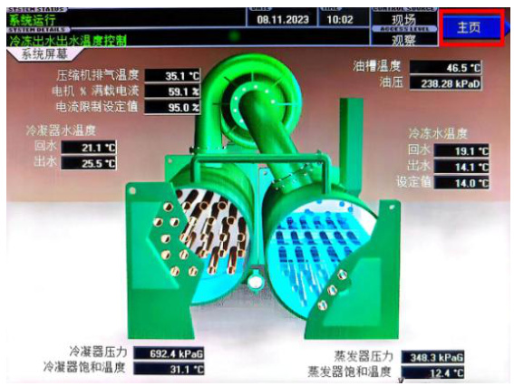
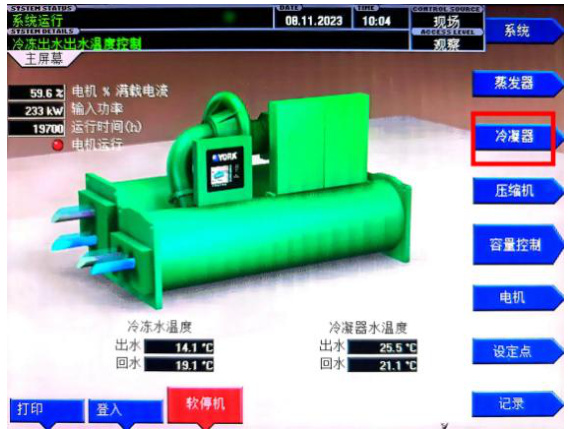
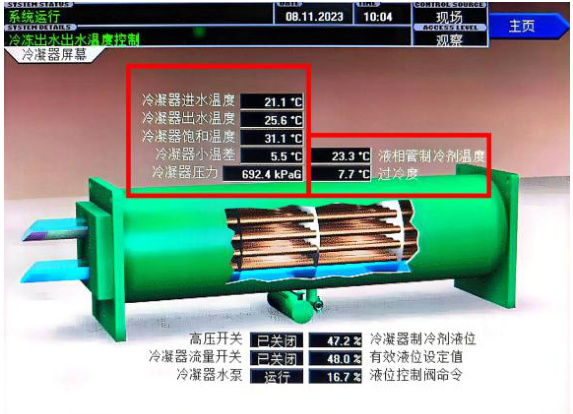
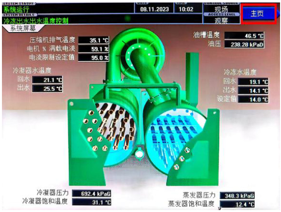
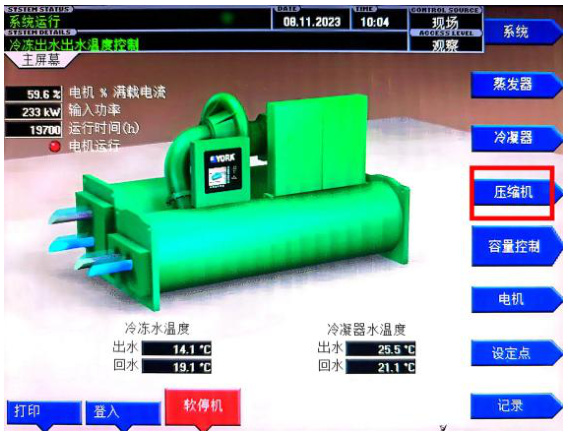
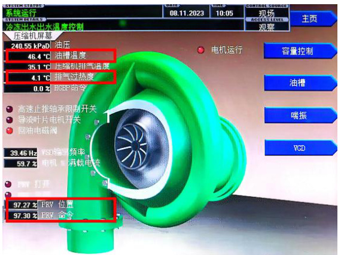
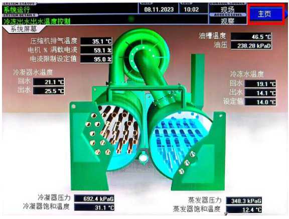
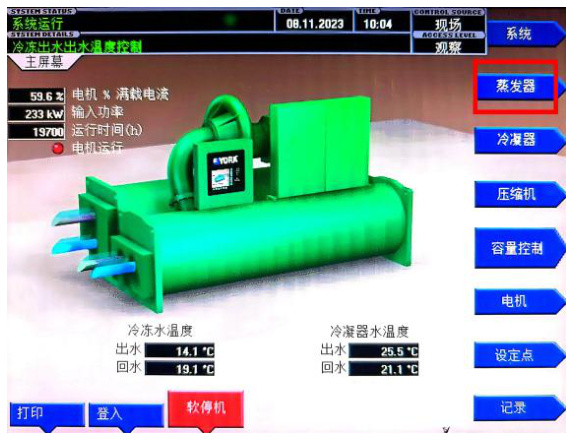
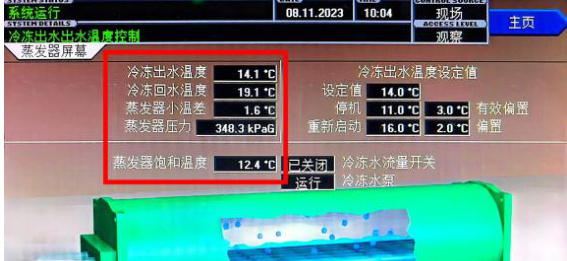

冷水机组状态参数查询操作流程标准(SOP)  

<html><body><table><tr><td>第01部分</td><td>流程名称</td><td>流程编号</td><td>版本号</td></tr><tr><td>SOP标题</td><td>冷水机组状态参数查看(SOP)</td><td>SD-YJD-LSJZ-04</td><td>V1.0</td></tr><tr><td>第02部分 现场信息</td><td>基地名称 云计算基地</td><td>适用范围 A2</td><td>专业负责人 叶笑鸣</td></tr><tr><td rowspan="5">第03部分 设备信息</td><td>设备厂家</td><td>设备名称</td><td>设备型号</td></tr><tr><td>约克</td><td>约克离心冷水机组</td><td>YKK8K3H95ERG/RK</td></tr><tr><td>负责人电话</td><td>售后联系电话</td><td>22BVR 设备厂家技术支</td></tr><tr><td>18100365780</td><td></td><td>持电话</td></tr><tr><td></td><td>15318761605 操作目的</td><td>400-1820-6607</td></tr><tr><td>第04部分</td><td colspan="3"></td></tr><tr><td colspan="4">为保证冷水机组运行状态正常，监控其运行状态，特制定此操作规程。</td></tr><tr><td colspan="4">第05部分 安全要求 1. 现场一人操作;</td></tr><tr><td colspan="4">2．做好个人防护</td></tr><tr><td colspan="4">第06部分 操作风险 1. 误操作，导致冷机运行异常</td></tr><tr><td colspan="4"></td></tr><tr><td>第07部分</td><td colspan="3">检查及准备工作、仪器仪表及耗材</td></tr><tr><td>无</td><td colspan="3"></td></tr><tr><td colspan="4">第8部分 操作执行后所做的检查工作 1.检查确认冷水机组正常运行 2.检查确认冷水机组运行参数正常</td></tr></table></body></html>  

<html><body><table><tr><td>第9部分</td><td colspan="3">操作批准</td></tr><tr><td rowspan="2">起草</td><td>起草人姓名</td><td>起草人职务</td><td>起草日期</td></tr><tr><td>李昱莹</td><td>维护工程师</td><td>2024年1月30日</td></tr><tr><td rowspan="2">审核</td><td>审核人姓名</td><td>审核人职务</td><td>审核日期</td></tr><tr><td>叶笑鸣</td><td>运维部主管</td><td>2024年3月29</td></tr><tr><td rowspan="2">批准</td><td>批准人姓名</td><td>批准人职务</td><td>批准日期</td></tr><tr><td>曹荣鑫</td><td>运维部主任</td><td>2024年3月29</td></tr><tr><td>第10部分</td><td colspan="3">本标准操作流程</td></tr></table></body></html>  

# 一、打开冷机冷凝器主页面  

1.1 点击冷机面板控制键中的“主页”按钮。  

  
1.2 点击冷机面板控制键中的“冷凝器”按钮。  

# 二、查看冷凝器参数  

  

2.1 查看面板上对应的冷凝器进水温度、冷凝器出水温度、冷凝器饱和温度、冷凝器小温差、冷凝器压力、过冷度参数。  

冷凝器进水温度 $\langle32\,^{\circ}\mathrm{C}$ ；冷凝器出水温度$\langle37\,^{\circ}\!C$ ；冷凝器饱和温度 $533\,^{\circ}\mathrm{C}$ ；冷凝器小温差 $1{-}4\,^{\circ}\!C$ ；冷凝器压力 $850{-}900\mathrm{KPaG}$ ；过冷度 $6{-}14\,^{\circ}\mathrm{C}$ 。  

# 三、打开冷机压缩机主页面  

  

3.1 点击冷机面板控制键中的“主页”按钮。  

  
3.2 点击冷机面板控制键中的“压缩机”按钮。  

  

# 四、查看压缩机参数  

4.1 查看面板上对应的油槽温度、过热度、PRV 参数。  

油槽温度 $45{-}60\,^{\circ}\mathrm{C}$ ；过热度 $6{-}14\,^{\circ}\mathrm{C}$ ；PRV 参数 $0{-}100\%$ 。  

  

5.1 点击冷机面板控制键中的“主页”按钮。  

# 五、打开冷机蒸发器主页面  

  

5.2 点击冷机面板控制键中的“蒸发器”按钮。  

# 六、查看蒸发器参数  

  

6.1 查看面板上对应的冷冻出水温度、冷冻回水温度、蒸发器小温差、蒸发器压力参数。  

冷冻出水温度 $8{-}14~^{\circ}\mathrm{C}$ ；冷冻回水温度$13{-}19^{\circ}\mathrm{C}$ ；蒸发器小温差 $1-4\,^{\circ}\!C$ ；蒸发器压力37.9-533.7KpaG。  

  