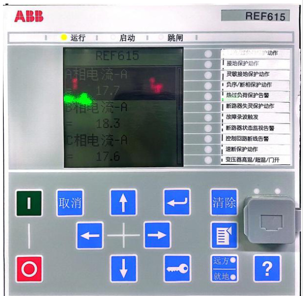
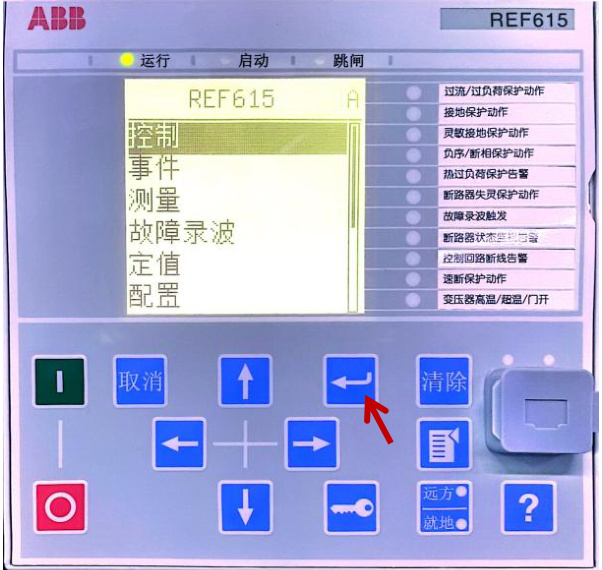

<html><body><table><tr><td rowspan="2">第01部分 SOP标题</td><td>流程名称</td><td>流程编号</td><td>版本号</td></tr><tr><td>高压柜故障界面查看操作流程 标准（SOP)</td><td>SD-YJD-GYG-04</td><td>V1.0</td></tr><tr><td rowspan="2">第02部分 现场信息</td><td>基地名称</td><td>适用范围</td><td>专业负责人</td></tr><tr><td>云计算基地</td><td>A1机楼</td><td>赵玲玲</td></tr><tr><td rowspan="4">第03部分 设备信息</td><td>设备厂家</td><td>设备名称</td><td>设备型号</td></tr><tr><td>ABB</td><td>高压柜</td><td>UniGear ZS1</td></tr><tr><td>负责人电话</td><td>售后联系电话</td><td>设备厂家技术支</td></tr><tr><td>袁军 (维保)</td><td></td><td>持电话 13805319420</td></tr><tr><td>第04部分</td><td colspan="3">执行本标准操作流程的原因</td></tr><tr><td colspan="4">指导查看ABB高压柜故障界面，特制定此操作规程。</td></tr><tr><td>第05部分</td><td colspan="3">本标准操作流程的安全要求</td></tr></table></body></html>  

1.现场操作应2 人，一人操作，另一人监护；  

2.准备好高压绝缘手套、绝缘靴及安全帽等；  

1.误操作，导致设备掉电；  

2.人身触电风险；  

  

1.提前准备操作过程中所使用的工具：高压绝缘手套、安全帽等。  

2.安装、操作和维护过程中必须使用专用的防护用具，如佩戴高压绝缘手套，佩戴护目镜、穿安全服、戴安全帽、穿安全鞋等。  

第8 部分 本标准操作流程执行后所做的检查工作  

1.检查确认高压柜面板状态指示灯指示正确；  

2.检查确认高压柜各参数是否合理范围内。  

<html><body><table><tr><td>第9部分</td><td colspan="3">本标准操作流程的批准</td></tr><tr><td rowspan="2">起草</td><td>起草人姓名</td><td>起草人职务</td><td>起草日期</td></tr><tr><td>赵玲玲</td><td>维护工程师</td><td>2024年2月20日</td></tr><tr><td rowspan="2">审核</td><td>审核人姓名</td><td>审核人职务</td><td>审核日期</td></tr><tr><td>叶笑鸣</td><td>维护工程师</td><td>2024年3月20日</td></tr><tr><td rowspan="2">批准</td><td>批准人姓名</td><td>批准人职务</td><td>批准日期</td></tr><tr><td>赵明</td><td>运维部主任</td><td>2024年3月20日</td></tr></table></body></html>  

# 一、故障界面查看  

1.1 点击“菜单”键，激活屏幕；  

  

1.2 点击“菜单”键，弹出菜单栏；1.3 点击向下的翻页按键，选中“事件”，点击图中所示按键，进入“事件”；  

  

1.4 选中“事件”后，可查看具体故障信息，如下图所示；  

<html><body><table><tr><td rowspan="7"></td><td></td></tr><tr><td>ABB REF615 运行 启动 跳闸</td></tr><tr><td>1/625 2023-05-29 0:00:40.078</td><td>过流/过负荷保护动作 接地保护动作 灵敏接地保护动作</td></tr><tr><td>以太网状态监视 A通道正常 是</td><td>负序/断相保护动作</td></tr><tr><td></td><td>热过负荷保护告警</td></tr><tr><td></td><td>断路器失灵保护动作 故障录波触发</td></tr><tr><td></td><td>断路器状态监视告</td></tr><tr><td></td><td>泾制回路新线告警 速断保护动作 变压器高温/超温/门开</td></tr><tr><td>取消</td><td>清除</td></tr><tr><td></td><td>远方</td></tr><tr><td></td><td>就地</td></tr><tr><td></td><td></td></tr></table></body></html>  