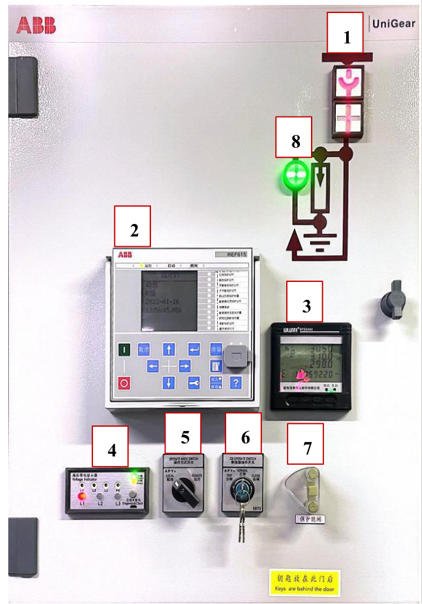
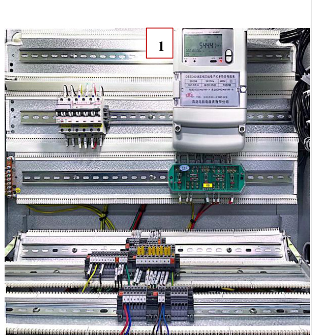
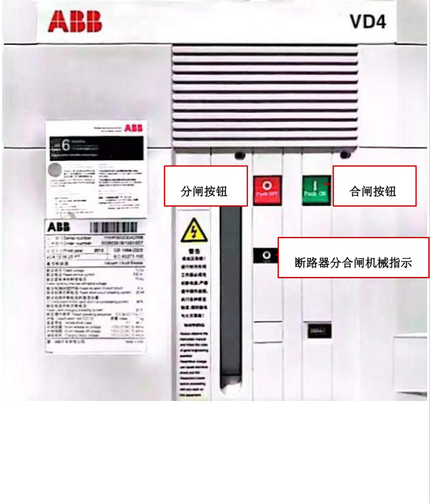

<html><body><table><tr><td rowspan="3">第01部分 SOP标题 第02部分</td><td>流程名称</td><td>流程编号</td><td>版本号</td></tr><tr><td>高压柜基本结构查看流程标准 (SOP)</td><td>SD-YJD-GYG-05</td><td>V1.0</td></tr><tr><td>基地名称</td><td>适用范围</td><td>专业负责人</td></tr><tr><td rowspan="3">现场信息 第03部分</td><td>云计算基地</td><td>A1机楼</td><td>赵玲玲</td></tr><tr><td>设备厂家</td><td>设备名称</td><td>设备型号</td></tr><tr><td>ABB</td><td>高压柜</td><td>UniGear ZS1</td></tr><tr><td rowspan="2">设备信息</td><td>负责人电话</td><td>售后联系电话</td><td>设备厂家技术支 持电话</td></tr><tr><td>袁军 (维保)</td><td></td><td>13805319420</td></tr><tr><td>第04部分</td><td colspan="3">执行本标准操作流程的原因</td></tr><tr><td></td><td colspan="3">便于查看ABB高压柜基本结构，特制定此操作规程。</td></tr><tr><td>第05部分 1.现场操作应2人，一人操作，另一人监护; 2.准备好高压绝缘手套、绝缘靴及安全帽等;</td><td colspan="3">本标准操作流程的安全要求</td></tr></table></body></html>  

1.误入带电间隔；  

<html><body><table><tr><td></td><td></td></tr><tr><td>第07部分</td><td>本标准操作流程所需各项检查及准备工作、仪器仪表及耗材</td></tr></table></body></html>  

1.提前准备操作过程中所使用的工具：高压绝缘手套、安全帽等。  

2.安装、操作和维护过程中必须使用专用的防护用具，如佩戴高压绝缘手套，佩戴护目镜、穿安全服、戴安全帽、穿安全鞋等。  

第8 部分 本标准操作流程执行后所做的检查工作  

1.检查确认高压柜面板状态指示灯指示正确；  

2.检查确认高压柜各参数是否合理范围内。  

<html><body><table><tr><td>第9部分</td><td colspan="3">本标准操作流程的批准</td></tr><tr><td rowspan="2">起草</td><td>起草人姓名</td><td>起草人职务</td><td>起草日期</td></tr><tr><td>赵玲玲</td><td>维护工程师</td><td>2024年2月20日</td></tr><tr><td rowspan="2">审核</td><td>审核人姓名</td><td>审核人职务</td><td>审核日期</td></tr><tr><td>叶笑鸣</td><td>维护工程师</td><td>2024年3月20日</td></tr><tr><td rowspan="2">批准</td><td>批准人姓名</td><td>批准人职务</td><td>批准日期</td></tr><tr><td>赵明</td><td>运维部主任</td><td>2024年3月20日</td></tr></table></body></html>  

# 一、认识高压柜基本结构  

1.1 高压柜基本结构如下图所示：  

1 断路器状态指示灯；  
2 表示微机保护测控装置；  
3 表示配电监测仪；  
4 表示高压带电显示器；  
5 表示操作方式开关；  
6 表示断路器操作开关；  
7 表示保护跳闸装置；  
8 接地装置状态指示灯  

  
1.2 打开二次回路柜柜门，内部如下图所示，其中1 表示多功能电表。  

  

1.3 如下图所示，为高压柜真空断路器，其中绿色“push on”为合闸按钮，红色“push off”为分闸按钮，黑色标识为断路器分合闸机械指示，图例为圆圈表示分闸状态，图例为短竖线表示合闸状态。  

  