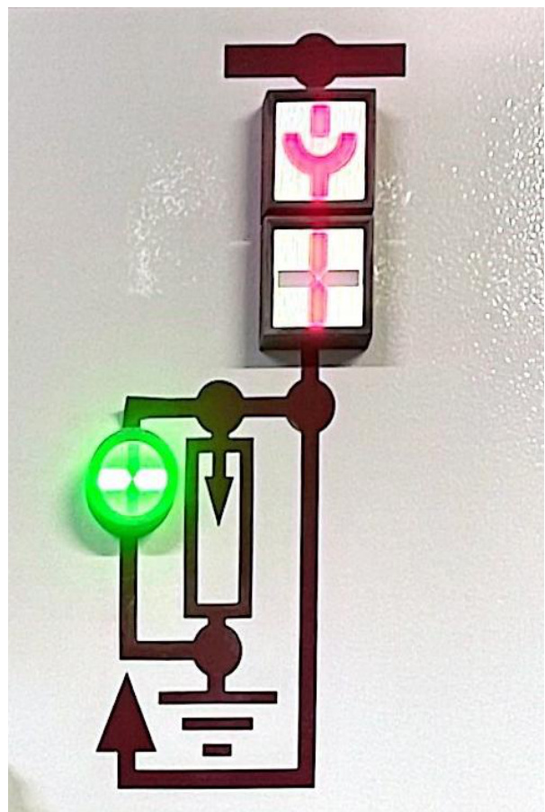
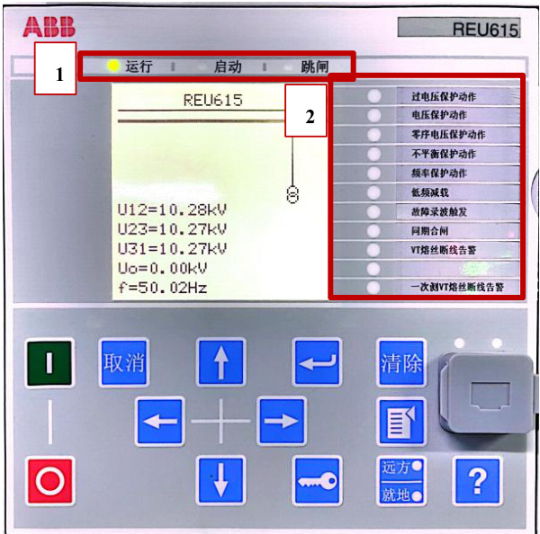
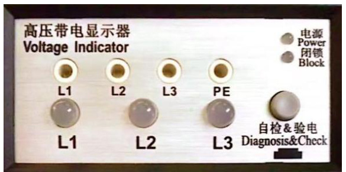

<html><body><table><tr><td rowspan="2">第01部分 SOP标题</td><td>流程名称</td><td>流程编号</td><td>版本号</td></tr><tr><td>高压柜状态指示灯查看操作流 程标准（SOP)</td><td>SD-YJD-GYG-06</td><td>V1.0</td></tr><tr><td rowspan="2">第02部分 现场信息</td><td>基地名称</td><td>适用范围</td><td>专业负责人</td></tr><tr><td>云计算基地</td><td>A1机楼</td><td>赵玲玲</td></tr><tr><td rowspan="4">第03部分 设备信息</td><td>设备厂家</td><td>设备名称</td><td>设备型号</td></tr><tr><td>ABB</td><td>高压柜</td><td>UniGear ZS1</td></tr><tr><td>负责人电话</td><td>售后联系电话</td><td>设备厂家技术支 持电话</td></tr><tr><td>袁军 (维保)</td><td></td><td>13805319420</td></tr><tr><td>第04部分</td><td colspan="3">执行本标准操作流程的原因</td></tr><tr><td colspan="2">指导查看ABB高压柜参数，特制定此操作规程。</td><td colspan="2"></td></tr><tr><td rowspan="2">第05部分</td><td colspan="3">本标准操作流程的安全要求</td></tr><tr><td colspan="2">1.现场操作应2人，一人操作，另一人监护；</td><td></td></tr></table></body></html>  

2.准备好高压绝缘手套、绝缘靴及安全帽等；  

1.误入带电间隔；  

  

1.提前准备操作过程中所使用的工具：高压绝缘手套、安全帽等。  

2.安装、操作和维护过程中必须使用专用的防护用具，如佩戴高压绝缘手套，佩戴护目镜、穿安全服、戴安全帽、穿安全鞋等。  

第8 部分 本标准操作流程执行后所做的检查工作  

1.检查确认高压柜面板状态指示灯指示正确；  

2.检查确认高压柜各参数是否合理范围内。  

<html><body><table><tr><td>第9部分</td><td colspan="3">本标准操作流程的批准</td></tr><tr><td rowspan="2">起草</td><td>起草人姓名</td><td>起草人职务</td><td>起草日期</td></tr><tr><td>赵玲玲</td><td>维护工程师</td><td>2024年2月20日</td></tr><tr><td rowspan="2">审核</td><td>审核人姓名</td><td>审核人职务</td><td>审核日期</td></tr><tr><td>叶笑鸣</td><td>维护工程师</td><td>2024年3月20日</td></tr><tr><td rowspan="2">批准</td><td>批准人姓名</td><td>批准人职务</td><td>批准日期</td></tr><tr><td>赵明</td><td>运维部主任</td><td>2024年3月20日</td></tr></table></body></html>  

# 、状态指示灯  

1.1 如下图开关柜指示灯所示，其中红色表示连通状态，绿色表示断开状态。  

  

1.2 如下图微机保护测控装置所示，其中，1 表示该设备的三种运行状态：运行、启动和跳闸，当“运行”前的信号灯亮时，表示当前为运行状态；2表示跳闸保护，例如，当过电压保护动作前信号灯亮时，表示内部发生过电压保护动作。  

  

1.3 如下图高压带电显示器所示，在验电状态下，当被测设备带电时，电源指示灯亮，A、B、C 三相指示灯闪亮，且输出强制闭锁信号；当被测设备不带电时，电源指示灯亮，A、B、C三相指示灯熄灭，同时解除闭锁信号，可进行设备操作；开关柜二次无电且高压侧无电，带电显示器电源灯不亮，三相高压指示灯不亮解除闭锁信号。  

  