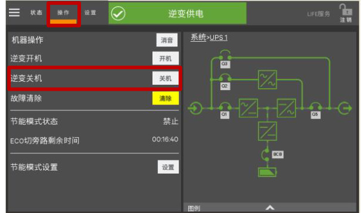
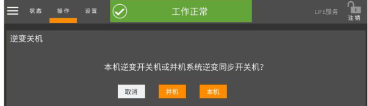
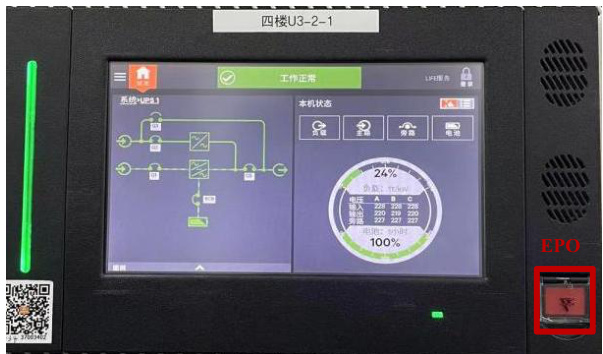
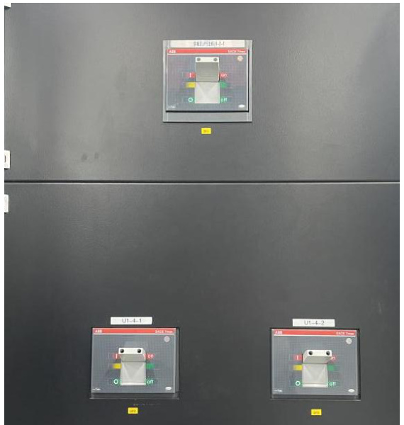
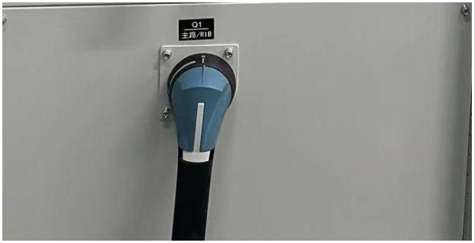
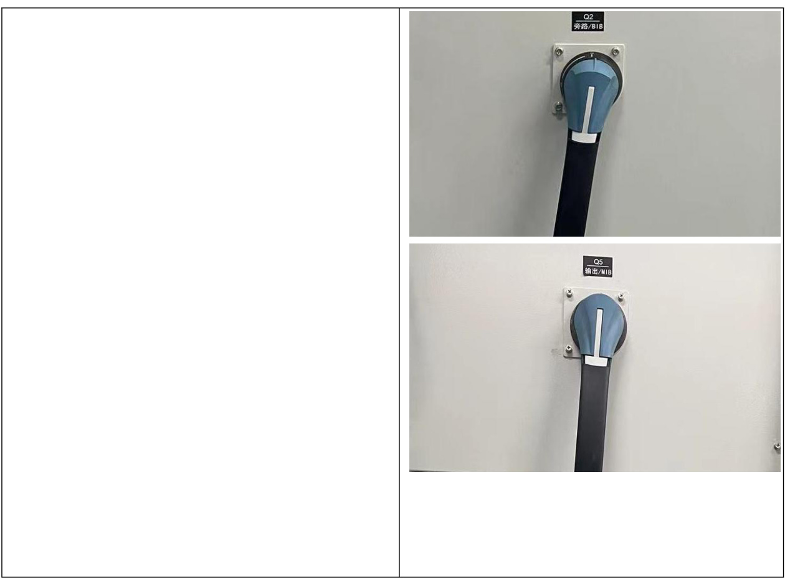

<html><body><table><tr><td rowspan="2">第01部分 SOP标题</td><td>流程名称</td><td>流程编号</td><td>版本号</td></tr><tr><td>维谛模块化UPS单机下电关机 操作流程标准（SOP)</td><td>SD-YJD-UPS-03</td><td>V1.0</td></tr><tr><td rowspan="2">第02部分 现场信息</td><td>基地名称</td><td>适用范围</td><td>专业负责人</td></tr><tr><td>云计算基地</td><td>A2机楼</td><td>赵玲玲</td></tr><tr><td rowspan="3">第03部分 设备信息</td><td>设备厂家</td><td>设备名称</td><td>设备型号 Liebert EPM</td></tr><tr><td>维谛</td><td>不间断供电系统</td><td>0400kTK16FN0100 0</td></tr><tr><td>负责人电话</td><td>售后联系电话</td><td>设备厂家技术支 持电话 13210093575</td></tr><tr><td>第04部分</td><td colspan="3">刘晓辉 13210093575 执行本标准操作流程的原因</td></tr><tr><td colspan="4">为指导UPS单机下电关机操作，特制定此规程（此操作所有电源开关、隔离开关和断路 器均断开，UPS不再给负载供电。）。</td></tr><tr><td>第05部分 1.现场操作应2人，一人操作，另一人监护；</td><td colspan="3">本标准操作流程的安全要求</td></tr><tr><td colspan="4">2.准备好绝缘手套、绝缘靴及安全帽等；</td></tr><tr><td colspan="4">第06部分 本标准操作流程的各种风险</td></tr><tr><td colspan="4">1.误操作，导致设备掉电; 2.人身触电风险；</td></tr><tr><td colspan="4">第07部分 本标准操作流程所需各项检查及准备工作、仪器仪表及耗材</td></tr><tr><td colspan="4">1.提前准备操作过程中所使用的工具：低压绝缘手套、安全帽等。 2.安装、操作和维护过程中必须使用专用的防护用具，如佩戴低压绝缘手套，佩戴护目镜、 穿安全服、戴安全帽、穿安全鞋等。</td></tr><tr><td colspan="4">第8部分 本标准操作流程执行后所做的检查工作</td></tr></table></body></html>  

1.检查确认UPS 已断电；  

2.UPS 下电后，电池端子仍有危险电压，需注意安全。  

<html><body><table><tr><td>第9部分</td><td colspan="3">本标准操作流程的批准</td></tr><tr><td rowspan="2">起草</td><td>起草人姓名</td><td>起草人职务</td><td>起草日期</td></tr><tr><td>赵玲玲</td><td>维护工程师</td><td>2024年2月20日</td></tr><tr><td rowspan="2">审核</td><td>审核人姓名</td><td>审核人职务</td><td>审核日期</td></tr><tr><td>叶笑鸣</td><td>维护工程师</td><td>2024年3月20日</td></tr><tr><td rowspan="2">批准</td><td>批准人姓名</td><td>批准人职务</td><td>批准日期</td></tr><tr><td>赵明</td><td>运维部主任</td><td>2024年3月20日</td></tr></table></body></html>  

# 一、按下操作面板上的逆变关闭按钮；  

1.1 点击、唤醒屏幕；  

1.2 点击屏幕“操作”按钮，弹出操作菜单；  

  

1.4 若单机逆变关机，选择“本机”，若并机逆变关机选择“并机”；  

  

# 二、按下EPO 按钮；  

2.1 按下“EPO”按钮，停止整流器、静态开关和电池的运行。  

  

# 三、断开外置电池开关；  

3.1 将外置电池总开关由“ON”按压 至“OFF”位置；   
3.2 将外置电池各分开关由“ON”按 压至“OFF”位置。  

  

4.1 断开主路输入开关、旁路输入开关、输出开关。此时所有内部电源关闭，LCD 显示关闭。  

# 四、依次断开UPS 主路输入开关、旁路输入开关、输出开关。  

  

  