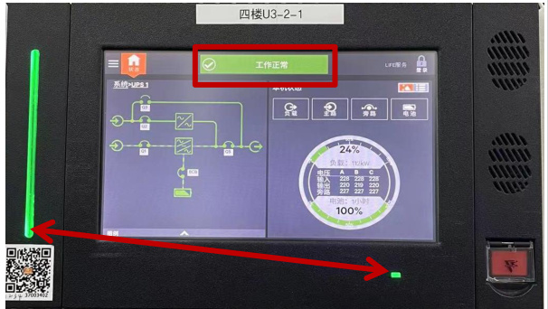

<html><body><table><tr><td rowspan="2">第01部分 SOP标题</td><td>流程名称</td><td>流程编号</td><td>版本号</td></tr><tr><td>维谛模块化UPS 故障告警查看 操作流程标准 （SOP)</td><td>SD-YJD-UPS-02</td><td>V1.0</td></tr><tr><td rowspan="2">第02部分 现场信息</td><td>基地名称</td><td>适用范围</td><td>专业负责人</td></tr><tr><td>云计算基地</td><td>A2机楼</td><td>赵玲玲</td></tr><tr><td rowspan="4">第03部分 设备信息</td><td>设备厂家</td><td>设备名称</td><td>设备型号</td></tr><tr><td>维谛</td><td>不间断供电系统</td><td>Liebert EPM 0400kTK16FN0100 0</td></tr><tr><td>负责人电话</td><td>售后联系电话</td><td>设备厂家技术支 持电话</td></tr><tr><td>刘晓辉</td><td>13210093575</td><td>13210093575</td></tr><tr><td>第04部分</td><td colspan="3">执行本标准操作流程的原因</td></tr><tr><td colspan="4">便于查看UPS故障告警信息，针对故障快速处理，特制定此规程。</td></tr><tr><td>第05部分</td><td colspan="3">本标准操作流程的安全要求</td></tr><tr><td colspan="4">1.现场操作应2人，一人操作，另一人监护； 2.准备好低压绝缘手套、绝缘靴及安全帽等；</td></tr><tr><td colspan="4">第06部分 本标准操作流程的各种风险</td></tr><tr><td colspan="4">1.误操作，导致设备掉电; 2.人身触电风险；</td></tr></table></body></html>  

  

1.提前准备操作过程中所使用的工具：低压绝缘手套、安全帽等。  

2.安装、操作和维护过程中必须使用专用的防护用具，如佩戴低压绝缘手套，佩戴护目镜、穿安全服、戴安全帽、穿安全鞋等。  

第8 部分 本标准操作流程执行后所做的检查工作  

1、检查确认故障告警是否已消除；  

2.检查确认UPS 面板状态指示灯指示正确；  

3.检查确认UPS 各参数是否合理范围内。  

<html><body><table><tr><td>第9部分</td><td colspan="3">本标准操作流程的批准</td></tr><tr><td rowspan="2">起草</td><td>起草人姓名</td><td>起草人职务</td><td>起草日期</td></tr><tr><td>赵玲玲</td><td>维护工程师</td><td>2024年1月31日</td></tr><tr><td rowspan="2">审核</td><td>审核人姓名</td><td>审核人职务</td><td>审核日期</td></tr><tr><td>叶笑鸣</td><td>维护工程师</td><td>2024年3月20日</td></tr><tr><td rowspan="2">批准</td><td>批准人姓名</td><td>批准人职务</td><td>批准日期</td></tr><tr><td>赵明</td><td>运维部主任</td><td>2024年3月20日</td></tr></table></body></html>  

# 一、查看UPS 主屏幕故障告警；  

1.1 点击、唤醒屏幕；  

1.2 状态指示灯：如图所示，屏幕最左侧和右下角有两处状态指示灯。当指示灯绿色表示运行正常；黄色表示一般告警；红色表示严重告警。1.3 状态条：状态条背景颜色绿色表示正常；黄色代表一般告警，红色代表重要告警。消息内容说明告警信息，当前提示“工作正常”。  

  

1.4 UPS 运行状态：“绿色功率流”表示正常电压；“黄色功率流”表示电压超范围。“绿色组件”表示正常；“黄色组件”表示一般告警；“红色组件”表示严重告警。  

1.5 本机状态：如图所示，表盘上部表示负载，当负载超过设置的阈值，表头将显示黄色或红色；表头下部表示电池，当电池容量低于设置的阈值，表头将显示黄色或红色。黄色表示一般告警，红色表示严重告警。  

  

2.1 点击屏幕左上角“三条杠”图标；  
弹出“主菜单”；  

# 二、查看UPS 故障详细信息；  

2.2 点击主菜单“当前事件”，可查看当前事件的发生日期和时间、告警类型、事件ID，受影响的组件及其描述；  
2.3 点击主菜单“历史记录”，可查看历史事件的日期和时间、事件类型、事件ID、状态、受影响的组件及其描述。  

<html><body><table><tr><td rowspan="3"></td><td>工作正常</td><td>本机状态</td><td>LIFE服务 登录</td></tr><tr><td>系统>UPS1</td><td>电压 入 旁路</td><td>电池 24% 负载：112kW ABC 228228 220 219 228 227 227 227 220 电池：1小时 100%</td></tr><tr><td>状态 当前事件 历史记录 电池 屏幕保护 运行时间统计 部件信息 显示选项 技术支持 关于</td><td>工作正常 本机状态 路 24% 负载：113kW 输出 输入 229228227 219 219 228 228 220 旁路 228 电池：1小时 100%</td><td>LIFE服务 登录 电池</td></tr></table></body></html>  