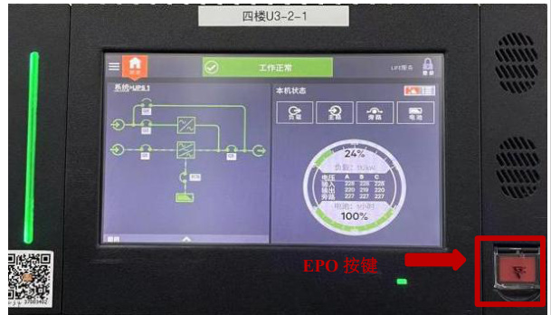
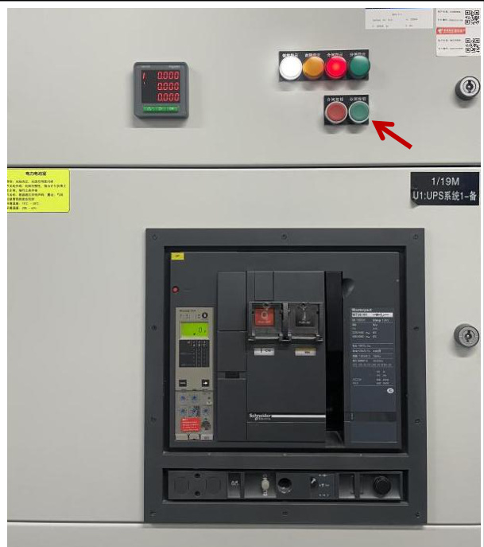
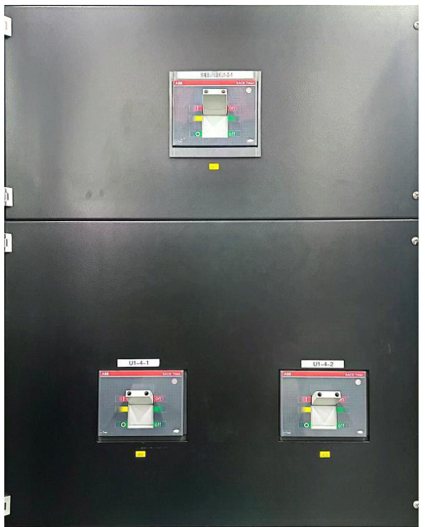

<html><body><table><tr><td rowspan="2">第01部分 SOP标题</td><td>流程名称</td><td>流程编号</td><td>版本号</td></tr><tr><td>维谛模块化UPS紧急停机操作 流程标准（SOP)</td><td>SD-YJD-UPS-04</td><td>V1.0</td></tr><tr><td rowspan="2">第02部分 现场信息</td><td>基地名称</td><td>适用范围</td><td>专业负责人</td></tr><tr><td>云计算基地</td><td>A2机楼</td><td>赵玲玲</td></tr><tr><td rowspan="4">第03部分 设备信息</td><td>设备厂家</td><td>设备名称</td><td>设备型号 Liebert EPM</td></tr><tr><td>维谛</td><td>不间断供电系统</td><td>0400kTK16FN0100 0</td></tr><tr><td>负责人电话</td><td>售后联系电话</td><td>设备厂家技术支 持电话</td></tr><tr><td>刘晓辉</td><td>13210093575</td><td>13210093575</td></tr><tr><td>第04部分</td><td colspan="3">执行本标准操作流程的原因</td></tr><tr><td colspan="4">用于在紧急情况下（如火灾、水灾等）关闭UPS，特制定此规程。</td></tr><tr><td colspan="4">第05部分 本标准操作流程的安全要求</td></tr><tr><td colspan="4">1.现场操作应2人，一人操作，另一人监护； 2.准备好绝缘手套、绝缘靴及安全帽等；</td></tr><tr><td colspan="4">第06部分 本标准操作流程的各种风险</td></tr><tr><td colspan="4">1.误操作，导致设备短路； 2.人身触电风险；</td></tr><tr><td colspan="4">第07部分 本标准操作流程所需各项检查及准备工作、仪器仪表及耗材</td></tr><tr><td colspan="4">1.提前准备操作过程中所使用的工具：绝缘手套、安全帽等。 2.安装、操作和维护过程中必须使用专用的防护用具，如佩戴绝缘手套，佩戴护目镜、穿 安全服、戴安全帽、穿安全鞋等。</td></tr><tr><td colspan="4">第8部分 本标准操作流程执行后所做的检查工作 检查确认UIPS系统已关闭</td></tr></table></body></html>  

2.检查确认UPSS 外部市电输入开关已断开。  

<html><body><table><tr><td>第9部分</td><td colspan="3">本标准操作流程的批准</td></tr><tr><td rowspan="2">起草</td><td>起草人姓名</td><td>起草人职务</td><td>起草日期</td></tr><tr><td>赵玲玲</td><td>维护工程师</td><td>2024年1月31日</td></tr><tr><td rowspan="2">审核</td><td>审核人姓名</td><td>审核人职务</td><td>审核日期</td></tr><tr><td>叶笑鸣</td><td>维护工程师</td><td>2024年3月20日</td></tr><tr><td rowspan="2">批准</td><td>批准人姓名</td><td>批准人职务</td><td>批准日期</td></tr><tr><td>赵明</td><td>运维部主任</td><td>2024年3月20日</td></tr><tr><td></td><td></td><td></td><td></td></tr></table></body></html>  

# 一、点击UPS 面板的EPO 按键；  

1.1 按下“EPO”开关或远程EPO 控制装置即可，系统将关闭整流器、逆变器，并迅速切断负载供电（包括逆变和旁路输出），且电池停止充电或放电。  

  

1.2 紧急停机后，UPS 仍有市电输入，UPS 控制电路仍带电，但UPS 输出已关闭。如需彻底断开UPS 的市电电源，应首先断开UPS 的外部市电输入开关。  

  

1.3 将外置电池总开关由“ON”切换至“OFF”；  

1.4 将外置电池分开关由“ON”切换 至“OFF”  

  