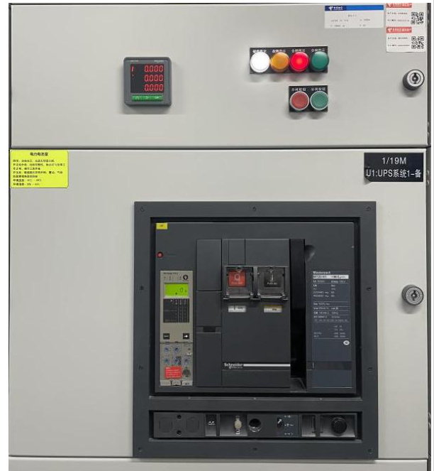
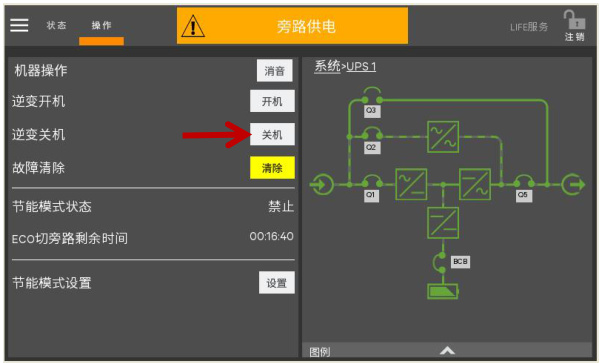
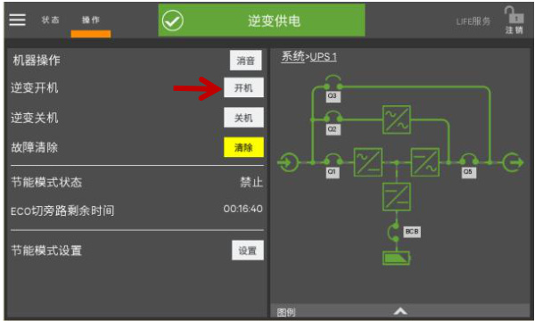
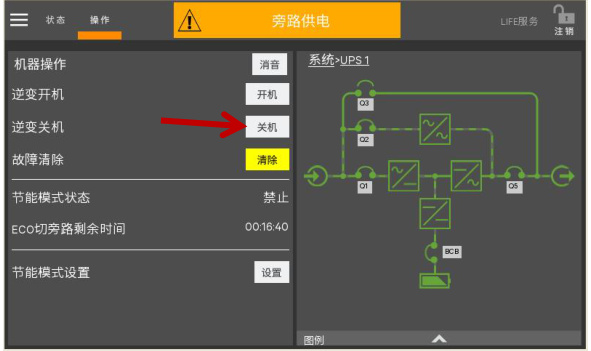
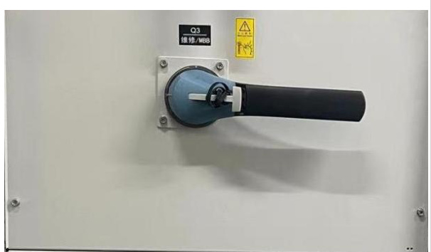
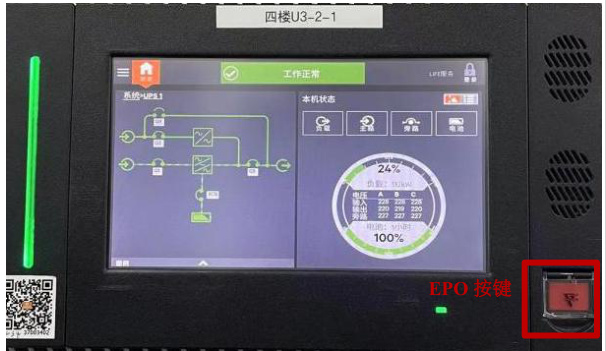
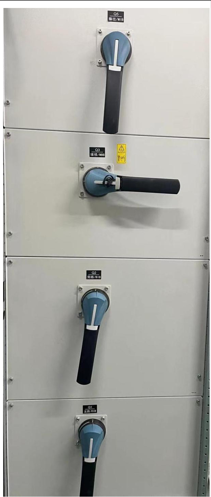
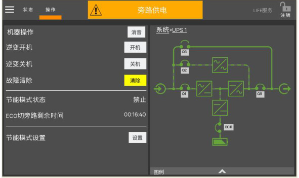
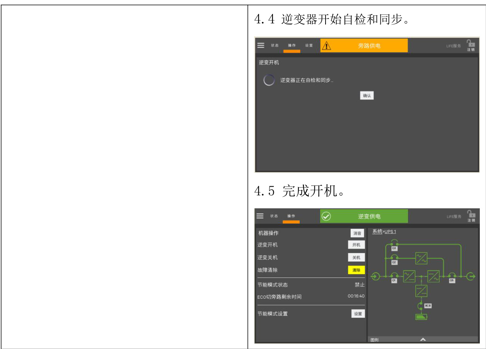

<html><body><table><tr><td rowspan="2">第01部分 SOP标题</td><td>流程名称</td><td>流程编号</td><td>版本号</td></tr><tr><td>维谛模块化UPS投切测试维护 操作流程（MOP)</td><td>SD-YJD-UPS-07</td><td>V1.0</td></tr><tr><td rowspan="2">第02部分 现场信息</td><td>基地名称</td><td>适用范围</td><td>专业负责人</td></tr><tr><td>云计算基地</td><td>A2机楼</td><td>赵玲玲</td></tr><tr><td rowspan="4">第03部分 设备信息</td><td>设备厂家</td><td>设备名称</td><td>设备型号</td></tr><tr><td>维谛</td><td>不间断供电系统</td><td>Liebert EPM 0400kTK16FN0100 0</td></tr><tr><td>负责人电话</td><td>售后联系电话</td><td>设备厂家技术支 持电话</td></tr><tr><td>刘晓辉</td><td>13210093575</td><td>13210093575</td></tr><tr><td>第04部分</td><td colspan="3">执行本标准操作流程的原因</td></tr><tr><td colspan="4">用于UPS投切测试，特制定此规程。</td></tr><tr><td>第05部分 1.现场操作应2人，一人操作，另一人监护；</td><td colspan="3">本标准操作流程的安全要求</td></tr><tr><td colspan="4">2.准备好低压绝缘手套、绝缘靴及安全帽等；</td></tr><tr><td>第06部分 1.误操作，导致设备掉电;</td><td colspan="3">本标准操作流程的各种风险</td></tr><tr><td colspan="4">2.人身触电风险；</td></tr><tr><td>第07部分</td><td colspan="3">本标准操作流程所需各项检查及准备工作、仪器仪表及耗材</td></tr><tr><td colspan="4">1.提前准备操作过程中所使用的工具：低压绝缘手套、安全帽等。</td></tr></table></body></html>  

2.安装、操作和维护过程中必须使用专用的防护用具，如佩戴低压绝缘手套，佩戴护目镜、穿安全服、戴安全帽、穿安全鞋等。  

第8 部分 本标准操作流程执行后所做的检查工作  

1.检查确认UPS 各指示灯显示正常。  

2.检查确认UPS 各参数在合理范围内。  

<html><body><table><tr><td>第9部分</td><td colspan="3">本标准操作流程的批准</td></tr><tr><td rowspan="2">起草</td><td>起草人姓名</td><td>起草人职务</td><td>起草日期</td></tr><tr><td>赵玲玲</td><td>维护工程师</td><td>2024年1月31日</td></tr><tr><td rowspan="2">审核</td><td>审核人姓名</td><td>审核人职务</td><td>审核日期</td></tr><tr><td>叶笑鸣</td><td>维护工程师</td><td>2024年3月20日</td></tr><tr><td rowspan="2">批准</td><td>批准人姓名</td><td>批准人职务</td><td>批准日期</td></tr><tr><td>赵明</td><td>运维部主任</td><td>2024年3月20日</td></tr></table></body></html>  

# 一、正常模式切换到电池模式  

1.1 断开外部电源开关切断市电，UPS进入电池模式。  
1.2 如需将UPS 切换回正常模式，需重新闭合外部电源开关，重新供入市电。  
1.3 10 秒后，整流器自动重启，UPS恢复至正常模式。  

  

# 二、正常模式切换到旁路模式  

2.1 点击图中所示的关机按钮，可将UPS 切换至旁路模式。  

  

2.2 旁路模式下，点击图中所示的开机按钮，完成逆变开机后，UPS 切换到正常模式。  

  

# 三、正常模式切换到维修模式  

3.1 点击“逆变关机”，确认关闭逆变器；  

  

3.2 打开维修旁路开关上的锁，顺时针旋转手柄至与水平面垂直，可闭合内部维修旁路开关Q3；  

  

3.3 此时维修旁路与UPS 静态旁路并联，显示面板显示“维修空开闭合”；3.4 按下面板EPO 按钮，停止整流器、逆变器、静态开关和电池的运行；  

  

3.5 断开主路输入开关Q1、旁路输入开关Q2，再断开输出开关Q5，此时所有内部电源关闭，触摸屏显示关闭；  

  

3.6 如需维护，等约10min，使内部直流母线电容电压放电后再维修。  

# 四、维修模式切换到正常模式  

4.1 依次闭合输出开关Q5、外部电源旁路开关、旁路开关Q2、外部电源主路开关和主路开关Q1，确认显示屏点亮，旁路开始供电；  

  

4.2 断开维修旁路开关Q3；  
4.3 待整流器完成启动，旁路开始供电以后，点击开机按钮。  

  

  