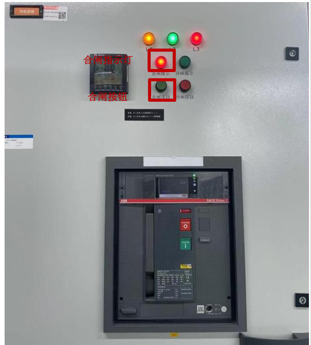
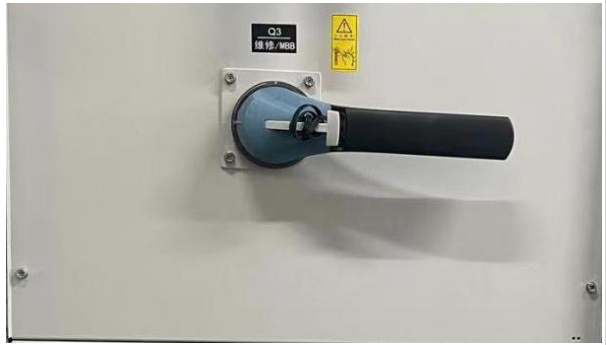
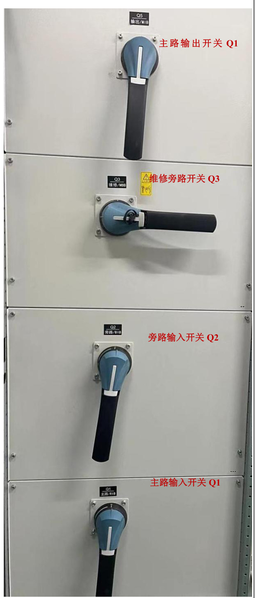
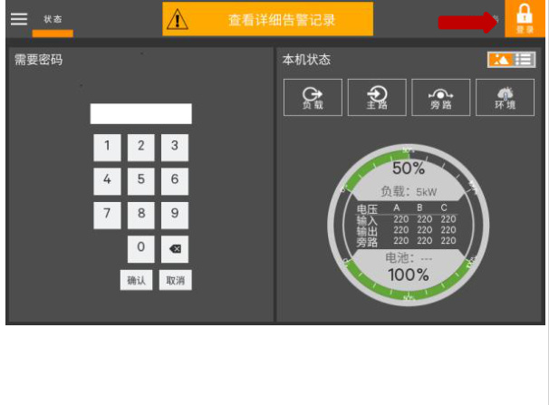
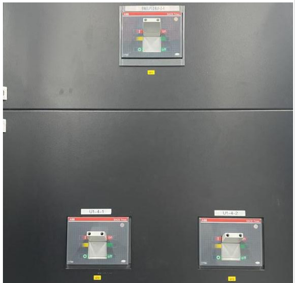
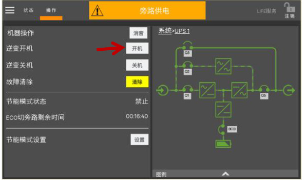
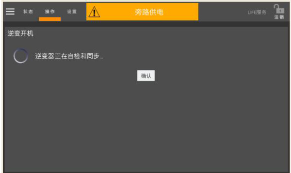

<html><body><table><tr><td>第01部分 SOP标题</td><td>流程名称 维谛模块化UPS单机上电开机 操作流程标准（SOP)</td><td>流程编号 SD-YJD-UPS-05</td><td>版本号 V1.0</td></tr><tr><td>第02部分 现场信息</td><td>基地名称</td><td>适用范围</td><td>专业负责人</td></tr><tr><td rowspan="4">第03部分 设备信息</td><td>云计算基地 设备厂家</td><td>A2机楼</td><td>赵玲玲</td></tr><tr><td></td><td>设备名称</td><td>设备型号 Liebert EPM</td></tr><tr><td>维谛</td><td>不间断供电系统</td><td>0400kTK16FN0100 0</td></tr><tr><td>负责人电话 刘晓辉</td><td>售后联系电话 13210093575</td><td>设备厂家技术支 持电话 13210093575</td></tr><tr><td>第04部分</td><td colspan="3">执行本标准操作流程的原因</td></tr><tr><td colspan="4">为指导UPS在完全断电状态下开机，特制定此规程。</td></tr><tr><td colspan="4">第05部分 本标准操作流程的安全要求 1.现场操作应2人，一人操作，另一人监护；</td></tr><tr><td colspan="4">2.准备好低压绝缘手套、绝缘靴及安全帽等； 第06部分 本标准操作流程的各种风险</td></tr><tr><td colspan="4">1.误操作，导致设备掉电；</td></tr><tr><td colspan="4">2.人身触电风险； 第07部分 本标准操作流程所需各项检查及准备工作、仪器仪表及耗材</td></tr><tr><td colspan="4">1.提前准备操作过程中所使用的工具：低压绝缘手套、安全帽、验电笔、万用表。</td></tr><tr><td colspan="4">第8部分 本标准操作流程执行后所做的检查工作</td></tr><tr><td colspan="4">1.检查确认UPS面板状态指示灯指示正确;</td></tr><tr><td colspan="4">2.检查确认UPS 输出电压。 起草日期</td></tr><tr><td colspan="4">第9部分 本标准操作流程的批准 起草 起草人姓名 起草人职务</td></tr></table></body></html>  

<html><body><table><tr><td></td><td>赵玲玲</td><td>维护工程师</td><td>2024年2月20 ）日</td></tr><tr><td rowspan="2">审核</td><td>审核人姓名</td><td>审核人职务</td><td>审核日期</td></tr><tr><td>叶笑鸣</td><td>维护工程师</td><td>2024年3月20 0日</td></tr><tr><td rowspan="2">批准</td><td>批准人姓名</td><td>批准人职务</td><td>批准日期</td></tr><tr><td>赵明</td><td>运维部主任</td><td>2024年3月20日</td></tr></table></body></html>  

1.1 点击主输入的“合闸按钮”;  

# 一、闭合外部电源输入开关；  

1.2 确认“合闸指示”灯亮。  

  

# 二、确认内部维修旁路开关Q3为断开状态；  

2.1 打开UPS 前门，确认内部维修旁路开关Q3 为断开状态，接入电缆与接线排可靠连接。  

  

三、依次闭合输出开关Q5、旁路输入开关Q2、主路输入开关Q1；  

3.1 依次闭合输出开关Q5、旁路输入开关Q2、主路输入开关Q1 。此时，系统上电，出现启动屏；  

  

3.2 约25 秒后，在触摸屏上点击右上角的登录图标，输入密码；  

  

# 四、闭合外置电池开关；  

4.1 先将外置电池各分开关（QF2 和QF3）由“OFF”按压至“ON”位置；4.2 再将外置电池总开关（QF1）由“OFF”按压至“ON”位置；  

  

5.1 待整流器完成启动，旁路开始供电以后，点击“逆变开机”的“开机”按钮；  

# 五、待整流器完成启动，旁路开始供电后，点击开机按钮；  

  
5.2 逆变器开始自检和同步；  

  

5.3 完成开机；  

<html><body><table><tr><td>状态 操作 逆变供电 LIFE服务 注销 机器操作 消音 系统>UPS1 逆变开机 开机 Q3 逆变关机 关机 故障清除 清除 ZZ 节能模式状态 禁止 ECO切旁路剩余时间 00:16:40 BCB 节能模式设置 设置</td></tr></table></body></html>  